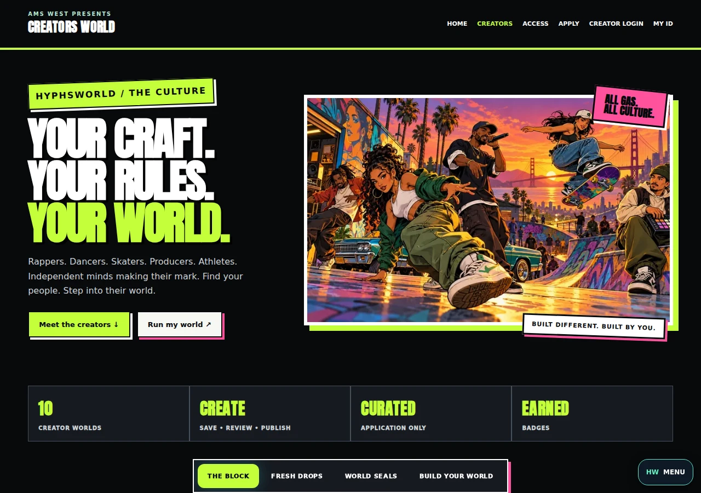
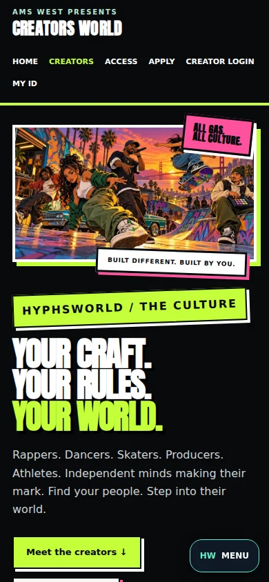
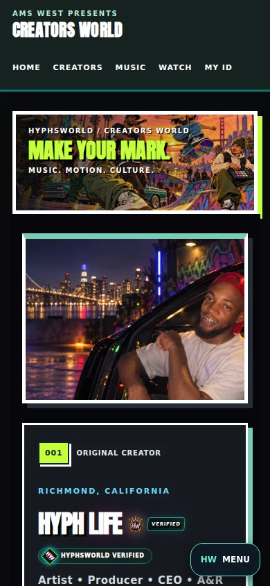
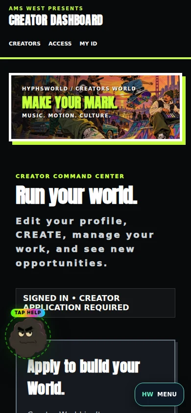

# Creator World urban culture design

Original cartoon culture artwork, dark poster panels, bold display type, lime and pink accents, and framed creator portraits. The complete proposed design covers all 18 pages, but this draft publishes only 13 pages (six profiles and seven tools). Automatic approval review blocked uploading existing minor-related profile content in `creator-lil-g.html`, `creator-sixx-figgaz.html`, `creator-ykomusic.html`, `creator-kili-631.html`, and `creators.html`; those five files remain unchanged in this PR pending explicit upload authorization. No profile content was newly introduced by the design. The full proposed code remains in the local implementation commit `078ad8e`. The mobile homepage places the scene first. Existing creator data, saved customization, ownership checks, forms, publication workflows and audio scripts remain intact. No database migration or production data write.

## Proposed design previews

The homepage images show the completed local proposal; its HTML upload is blocked and is not included in this draft. Profile and dashboard previews show included pages.

## Assets

- `assets/creator-world/urban-culture.webp`: 1672 × 940 hero and desktop cover.
- `assets/creator-world/urban-culture-mobile.webp`: 836 × 470 responsive hero and mobile cover.
- `assets/creator-world/fonts/Anton-Regular.ttf`: locally hosted Anton from the Google Fonts repository, licensed under the adjacent `OFL.txt`. Source: https://github.com/google/fonts/tree/main/ofl/anton
- `creator-urban.css`: scoped presentation layer; motion respects reduced-motion preferences.

Artwork generated with the built-in image generation tool, then compressed to WebP. Original characters and HYPHSWORLD identity; no copied game characters or logos. Prompt:

> Use case: stylized-concept. Asset type: original wide website hero mural for HYPHSWORLD Creator World. Create an energetic 2D illustrated urban culture ensemble poster, influenced by the bold ink outlines, cinematic character collage, saturated sunset lighting and graphic composition of open-world game cover art. Entirely original characters, no game characters or game logos. Diverse adult women and men: a woman street dancer in a dynamic footwork pose, a Black male rapper with microphone and simple streetwear, a female skateboarder doing a stylish board trick, a Latino male producer holding a small beat sampler, and a second dancer. Adult characters fully clothed, friendly confident expressions. Rich Bay Area setting: Richmond street, colorful graffiti skate park, palm trees, music studio door, lowrider detail, Golden Gate silhouette at sunset. Bold black outlines, hand-painted cel shading, warm orange and magenta sky, electric lime accents, teal shadows, lively motion, stylish fashion. Landscape composition approx 16:9. Strong full ensemble composition without chopped heads or hands, dancers and skater silhouettes distinct and readable on phones. No typography, no words, no watermarks, no guns, no drugs, no violence. Make this look like an exciting premium urban cartoon world where music, skating and dancing meet.

## Validation

- 74 Jest tests across 16 suites passed.
- Full site diagnostics passed.
- Browser checks passed for all 18 pages at 320, 390 and 1280 pixels, including search, keyboard tabs, profile music selection, creator management links, saved profile content and publication rendering.
- Tool screenshots expose existing owner forms through a disconnected synthetic client. These layout checks do not prove production account authorization or write to production.
- Supabase read-only check confirmed ten published creators; no auth, RLS or storage configuration change.

Run browser checks using `NODE_PATH=<playwright-install>/node_modules node scripts/check-creator-skate-browser.js`. The existing script filename is retained for CI compatibility.
